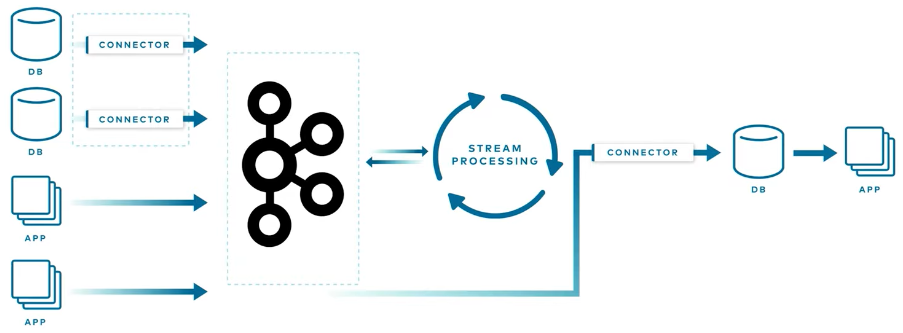
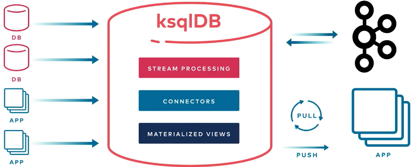

# RocksDB ad materialized cache

Confluent's resources are the best to understand this:

- [KsqlDb as Cache](https://docs.ksqldb.io/en/latest/tutorials/materialized/?_ga=2.85364633.1662971564.1679486422-1513808645.1676907091#query-the-materialized-views)
- [KsqlDb Architecture](https://youtu.be/vcrLNuOBBMU)

KsqlDb replaces this acrchitecture:

With:

✔ Can it be fast?

This sample can return 19,000 users within seconds (Even with a where clause). Using the Kafka UI included here is slow, as it streams results.

It could get complicated when you have partitions and multiple ksql nodes, the user example in this repo does exactly that.

You can use the multi-node docker compose file to spin up multiple ksql nodes. http://localhost:8088/clusterStatus returns info on the whole cluster.