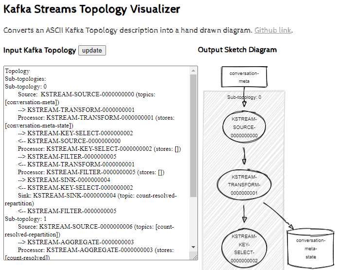

# Topology

Using KSQL CLI:

> DESCRIBE mv_enriched_user_roles EXTENDED;

Column: writeQueries
```json
[{
  ...
  "id": "CTAS_MV_TOPIC_NAME_1",
  ...
}]
```

> EXPLAIN CTAS_MV_TOPIC_NAME_1;

You can view the topology here: https://zz85.github.io/kafka-streams-viz/



Internal generated topics:

https://docs.ksqldb.io/en/latest/operate-and-deploy/capacity-planning/#generated-topics